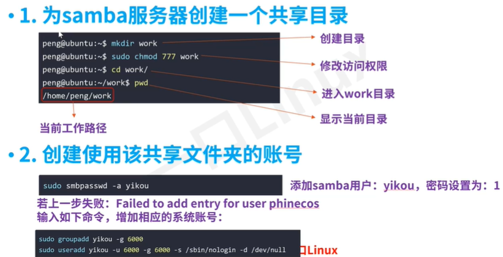
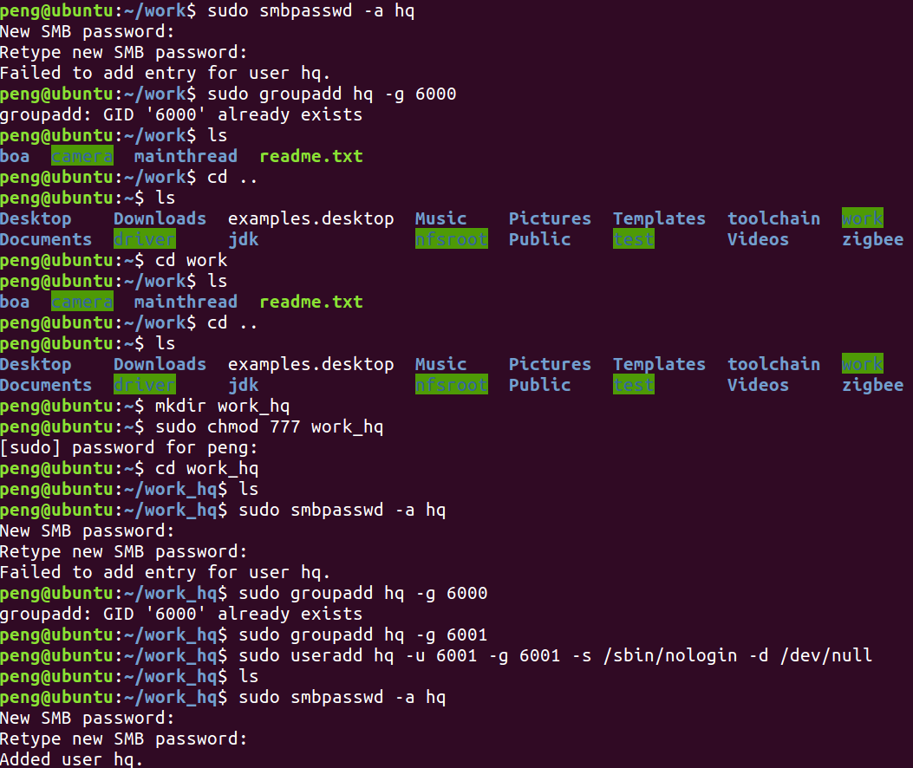
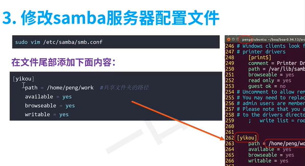
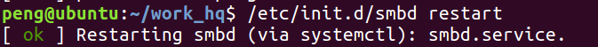
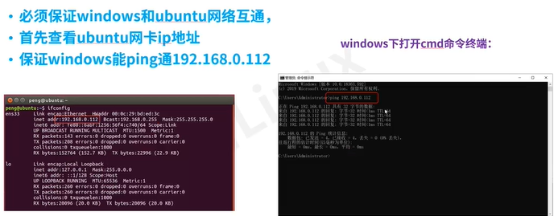
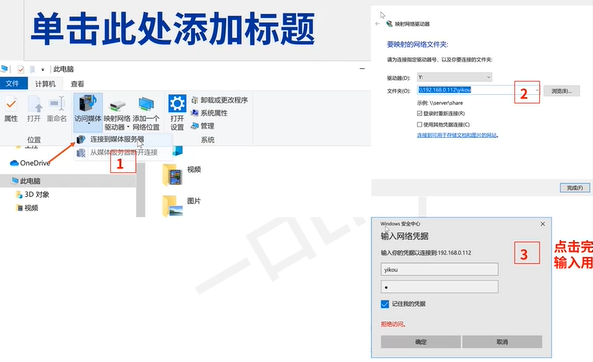
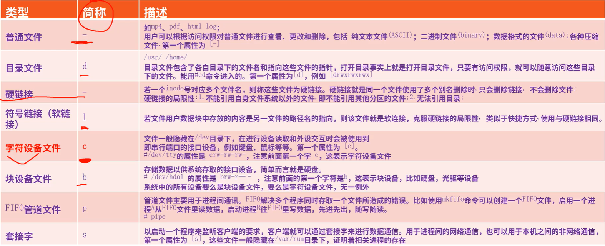

# Linux主控开发 - HQ

[TOC]

------

#### 注意

- 数组清零 `char buf[50] = {0};`

------

## 配置环境

### VMware中直接打开配置好的Ubuntu 16

```
用户名：peng
默认密码：1
```

修改分辨率，禁止锁屏，禁止更新软件

### 安装samba

```
sudo apt-get install samba samba-common
```

### 配置samba

> 

密码都是1

> 

### 修改samba服务器配置文件

> 

### 重启samba服务

> 

### windows创建映射

> 
>
> 
>
> 


## 链表操作

【参考课程PPT - 主控-链表操作】 & 【参考知识点 - 主控】 & 【参考课程代码讲解实例 - Linux系统编程 - list】

main.c

```c
#include <stdio.h>
#include <string.h>
#include <stdlib.h>
#include <unistd.h>
#include <errno.h>

#include "link_list.h"

extern linklist envlinkHead, envlinkTail;

#if 1
void main()
{
	link_datatype data;
	linklist tmpnode;

	/*初始化链表*/
	envlinkHead = CreateEmptyLinklist();


	/*插入节点1*/
	memset (&data, 0, sizeof (link_datatype));

	data.msg_type = 0x1;
	memcpy(data.text,"1111",sizeof(data.text));

	if ((InsertLinknode (data)) == -1)
	{
		printf("NOMEM\n");
		return;
	}

	/*插入节点2*/
	memset (&data, 0, sizeof (link_datatype));

	data.msg_type = 0x2;
	memcpy(data.text,"2222",sizeof(data.text));

	if ((InsertLinknode (data)) == -1)
	{
		printf("NOMEM\n");
		return;
	}

	/*提取节点*/
	while(1)
	{
		if ((tmpnode = GetLinknode(envlinkHead)) == NULL)
		{
			break;
		}

		printf("type:%x \ntext:%s\n",tmpnode->data.msg_type,tmpnode->data.text);
		
		free (tmpnode);

	}
	return ;
}
#elif
int main()
{
	link_datatype data;
	linklist tmpnode;

	/*初始化链表*/
	envlinkHead = CreateEmptyCacheList();
	envlinkTail = envlinkHead;


	/*插入节点1*/
	memset (&data, 0, sizeof (link_datatype));

	data.msg_type = 0x1;
	memcpy(data.text,"1111",sizeof(data.text));

	if ((InsertCacheNode(&envlinkTail,data)) == -1)
	{
		printf("NOMEM\n");
		return -1;
	}

	/*插入节点2*/
	memset (&data, 0, sizeof (link_datatype));

	data.msg_type = 0x2;
	memcpy(data.text,"22222",sizeof(data.text));

	if ((InsertCacheNode(&envlinkTail,data)) == -1)
	{
		printf("NOMEM\n");
		return -1;
	}

	/*提取节点*/
	while(1)
	{
		if ((tmpnode = GetCacheNode(envlinkHead,&envlinkTail)) == NULL)
		{
			break;
		}

		printf("type:%x \ntext:%s\n",tmpnode->data.msg_type,tmpnode->data.text);
		
		free (tmpnode);

	}
	return 0;
}
#endif
```

link_list.h

```c
#ifndef __LIST_QUEUE_H____
#define __LIST_QUEUE_H____

typedef struct msg_pack
{
	char msg_type;
	char text[27];
}link_datatype;

typedef struct _node_
{
	link_datatype data;
	struct _node_ *next;
}linknode, *linklist;

extern linklist CreateEmptyLinklist ();
extern int EmptyLinklist (linklist h);
extern linklist GetLinknode (linklist h);
extern int InsertLinknode (link_datatype x);

#endif

```

link_lish.c

```c
/*
从 zigbee采集到的数据存放的链表
*/
#include <stdio.h>

#include <string.h>
#include <stdlib.h>

#include "link_list.h"

linklist envlinkHead, envlinkTail;


linklist CreateEmptyLinklist()
{
	linklist h;
	h = (linklist)malloc (sizeof (linknode));
	envlinkTail = h;
	h->next = NULL;
	return h;
}

int EmptyLinklist (linklist h)
{
	return NULL == h->next;
}

linklist GetLinknode(linklist h)
{
	if (1 == EmptyLinklist (h))	
	{
		return NULL;
	}
	linklist p = h->next;
	h->next = p->next;
	if (p->next == NULL)
		envlinkTail = h;
	return p;
}

int InsertLinknode(link_datatype x)
{
	linklist q = (linklist)malloc (sizeof (linknode));
	if (NULL == q)
	{
		printf ("InsertLinknode Error\n");
		return -1;
	}
	envlinkTail->next = q;
	envlinkTail = q;
	q->data = x;
	q->next = NULL;

	return 0;
}


linklist CreateEmptyCacheList ()
{
	linklist h;
	h = (linklist) malloc (sizeof (linknode));
	h->next = NULL;
	return h;
}

linklist GetCacheNode (linklist h, linklist *t)
{
	if (1 == EmptyLinklist (h))
	{
		return NULL;
	}

	linklist p = h->next;
	h->next = p->next;
	if (p->next == NULL)
	{
		*t = h;
	}
	return p;
}


int InsertCacheNode (linklist *t, link_datatype x)
{
	linklist q = (linklist)malloc (sizeof (linknode));
	if (NULL == q)
	{
		printf ("InsertCacheNode Error\n");
		return -1;
	}
	(*t)->next = q;
	*t = q;
	q->data = x;
	q->next = NULL;

	return 0;
}
```


## 文件IO

【参考课程PPT - 主控-系统编程-文件IO】 & 【参考知识点 - 主控】 & 【参考课程代码讲解实例 - Linux系统编程 - io】

### Linux下文件类型

> 

read.c

```c
#include <unistd.h>
#include <sys/types.h>
#include <string.h>
#include <fcntl.h>
#include <stdio.h>
#include <errno.h>
extern int errno;

mode_t mode = 0444;

char *filename = "peng";

int main()
{
	int fd, pos;
	ssize_t bytes_read;
	char buf[512] = {0};

	fd = open(filename, O_RDONLY, mode);
	if (fd == -1)
	{
		printf("open file err \n");
		return -1;
	}

	bytes_read = read(fd, buf, sizeof(buf));

	printf("buf: %s  \nbytes_written:%d \n", buf, bytes_read);

	if (close(fd) < 0)
	{
		fprintf(stderr, "ERROR: close file %s failed:%s\n", filename, strerror(errno));
		return -1;
	}

	return 0;
}
```

write.c

```c
#include <unistd.h>
#include <sys/types.h>
#include <string.h>
#include <fcntl.h>
#include <stdio.h>
#include<errno.h>
extern int errno;

mode_t mode = 0444;

char *filename = "peng";

int main()
{
	int fd,pos,nbyres;
	ssize_t bytes_written;
	char buf[512]={0};
	
	fd = open(filename,O_RDWR | O_CREAT | O_TRUNC,mode);
	if(fd == -1)
	{
		printf("open file err \n");
		return -1;
	}
 
	strcpy(buf,"this is a test\n");
	nbyres = strlen(buf);
	
	bytes_written = write(fd,buf,nbyres);
	
	printf("nbyres: %d  bytes_written:%d \n",nbyres,bytes_written);
 
	if(close(fd) < 0)
	{
		fprintf(stderr,"ERROR: close file %s failed:%s\n",filename,strerror(errno));
		return -1;
	}
//	printf("%s\n",buf);
	return 0;
}
```


