# WirelessSersorMS - 物联网环境监测项目

[TOC]

------

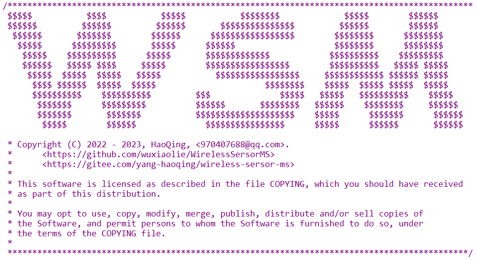

## 项目博文（个人博客）

**WirelessSersorMS系列文章**

***【[WirelessSersorMS - 物联网环境监测项目](https://wuxiaolie.github.io/hq.github.io/2022/07/25/WirelessSersorMS.html)】***

**树莓派开发系列文章**

***【[树莓派开发 - 基础使用教程](https://wuxiaolie.github.io/hq.github.io/2022/04/26/RaspberryPi.html)】***

***【[树莓派开发 - FTP云盘项目](https://wuxiaolie.github.io/hq.github.io/2022/06/15/RaspberryPi.html)】***

***【[树莓派开发 - 基于Socket的聊天室项目](https://wuxiaolie.github.io/hq.github.io/2022/06/12/RaspberryPi.html)】***

***【[树莓派开发 - libcurl库实现车牌识别](https://wuxiaolie.github.io/hq.github.io/2022/06/05/RaspberryPi.html)】***

***【[树莓派开发 - MJPG-Streamer视频方案](https://wuxiaolie.github.io/hq.github.io/2022/06/09/RaspberryPi.html)】***

***【[树莓派开发 - 交叉编译&内核编译](https://wuxiaolie.github.io/hq.github.io/2022/06/20/RaspberryPi.html)】***

***【[树莓派开发 - 驱动开发](https://wuxiaolie.github.io/hq.github.io/2022/06/28/RaspberryPi.html)】***

***【[树莓派开发 - wiringPi库开发](https://wuxiaolie.github.io/hq.github.io/2022/05/20/RaspberryPi.html)】***

***【[树莓派开发 - 应用开发](https://wuxiaolie.github.io/hq.github.io/2022/05/26/RaspberryPi.html)】***

***【[树莓派开发 - 贪吃蛇游戏开发](https://wuxiaolie.github.io/hq.github.io/2022/05/10/RaspberryPi.html)】***

***【[树莓派开发 - ncurses库开发](https://wuxiaolie.github.io/hq.github.io/2022/05/11/RaspberryPi.html)】***


## 项目名称

中文名称：基于 Zigbee 协议的物联网环境监测项目

英文名称：Wireless Sensor Monitoring System

简称：WirelessSersorMS


## 项目介绍

项目以 Zigbee 为通讯协议，**基于 CC2530 开发的协调器和多个终端节点进行组网**，并将接收到的环境传感器数据通过串口发送到**树莓派 Linux 主控**。

用户可通过**其他 Linux 客户端、安卓 APP** 访问树莓派主控，下发指令给协调器，远程控制终端节点硬件，采集环境信息，监控视频画面；同时，树莓派主控支持用户**远程注册、登录、查询数据库**，以及**通过 socket 连接下载日志和数据文件**。


## 应用技术

Zigbee 通讯协议（IEEE 802.15.4 低速率无线个域网（LR-WPAN）协议）

Linux系统编程，多线程开发，串口传输，socket编程，客户端、服务端开发

CC2530 驱动开发
- 软件 SPI，LCD 屏幕，LED，有源蜂鸣器，继电器，人体热释红外传感器，按键
- 光敏传感器（ADC），烟雾传感器（MQ-2气体传感器）、温湿度传感器（DHT11）


## 开源仓库

【[GitHub链接](https://github.com/wuxiaolie/WirelessSersorMS)】  【[Gitee链接](https://gitee.com/yang-haoqing/wireless-sersor-ms)】（点击链接可跳转）


## 项目开发流程

1. 新建Gitee仓库，配置仓库，添加README文档，整理项目文件。（2022.6.14）
   - https://gitee.com/yang-haoqing/wireless-sersor-ms
   - 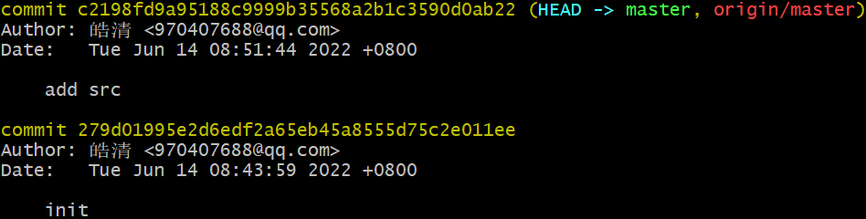
2. 添加文件到仓库，修改README文档。（2022.6.18）
   - 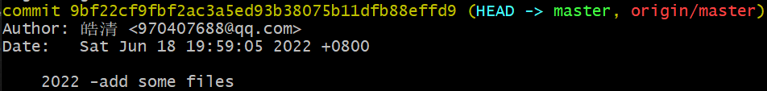

3. 将近期本地所有开发资料同步，补充README文档。（2022.8.6）
   - 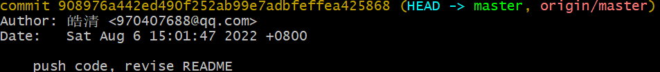


## 项目开发环境

### 软硬件环境

- 下位机：CC2530 

- OS：vmware + ubuntu

### 硬件连接图

买的CC2530板子已经集成了CH340芯片，usb线连接电脑，即可被识别。

> 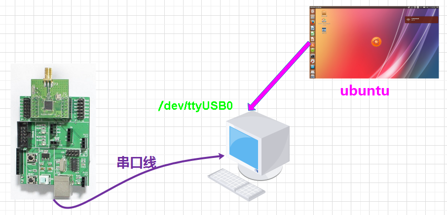


## 仓库内容

### 仓库目录

> 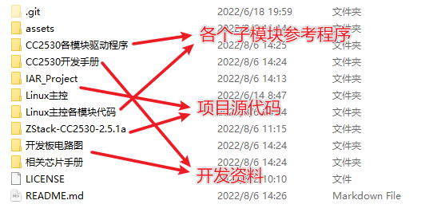

### CC2530各模块驱动程序

> 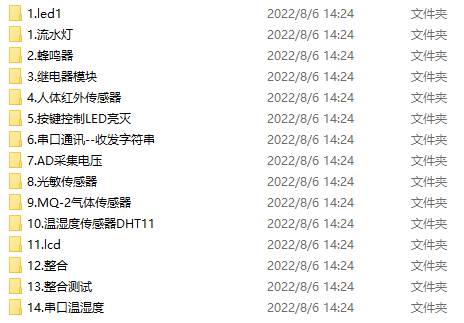

### Linux各模块程序

> 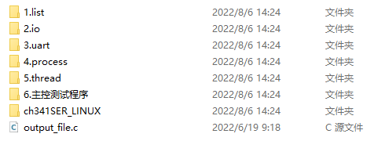

### CC2530工程源代码

>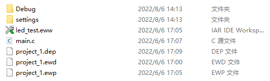
>
>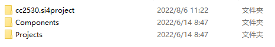

### Linux主控工程源代码

>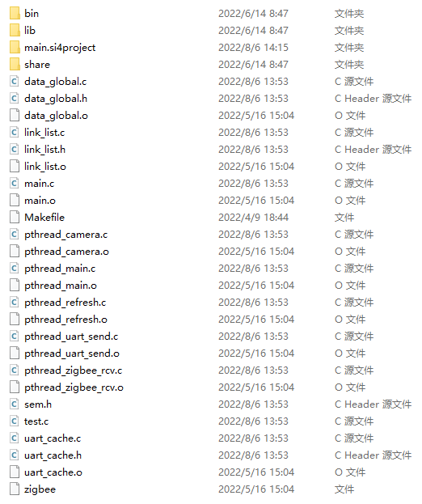

### CC2530开发手册

>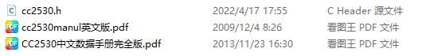

### 开发板电路图

> 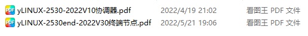

### 相关芯片手册

> 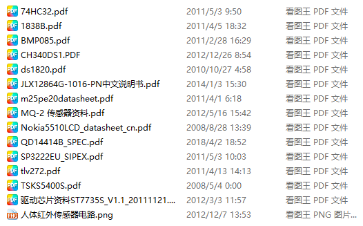


## 项目解答

| 疑问     | 内容                                                         | 解决方法          |
| -------- | ------------------------------------------------------------ | ----------------- |
| 网络通讯 | 自己写的服务端，客户端程序，只能在局域网内通讯，如果才能扩展到互联网呢？ | NAT-DDNS 内网穿透 |
|          |                                                              |                   |
|          |                                                              |                   |
|          |                                                              |                   |


## 项目环境配置

### 烧写程序及编译器配置

- IAR
- 串口驱动
- 烧录器驱动
- 串口工具

项目软件安装在 `D:\EmbeddedSoftware`

1. **注意：要以管理员身份进行安装。**

   - IAR软件尽量安装到默认位置，C盘。

   - 驱动安装成功

     > 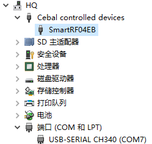

2. IAR工程创建

   - 创建项目
   - 新建文件，添加新组，添加文件到新组
   - 编译程序，烧录程序

3. Source Insight工程创建

   - 如果中文乱码，选择以指定编码重载

     > 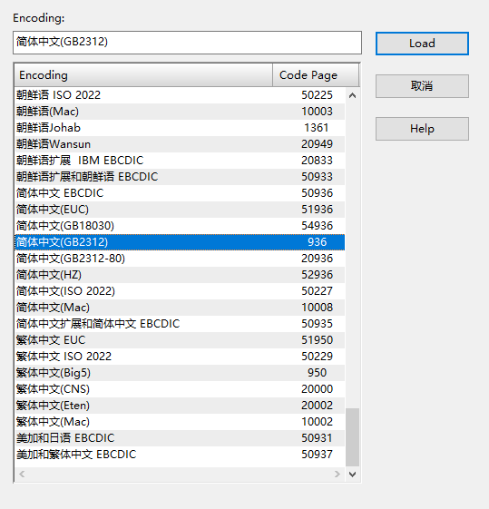

   - 快捷键

     - 选中变量，按F8，则高亮这个变量的所有位置

### 摄像头配置

**运行指令**

```shell
sudo ./start.sh
```

>虚拟机->可移动设备->摄像头

**配置方法**

```shell
./mjpg_streamer -i "./input_uvc.so -y -d /dev/video0" -o "./output_http.so -w ./www" -o "./output_file.so -f /www/pice -d 150000"  
```

>jpeg摄像头去掉-y
>
>摄像头对应字符设备 /dev/video0，如果不一致需要修改
>
>照片存储目录/www/pice
>
>自动拍照时间 150000

### sqlite3数据库配置

**创建并注册用户**

```
CREATE TABLE IF NOT EXISTS user(name text not null, password text not null);
INSERT INTO user VALUES('user','admin');
```

### 安装samba

```shell
sudo apt-get install samba samba-common
```

**配置samba**

> 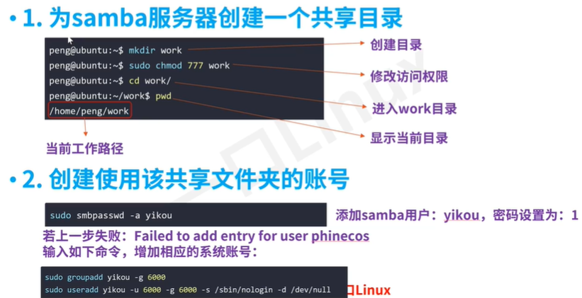

**密码都是1**

> 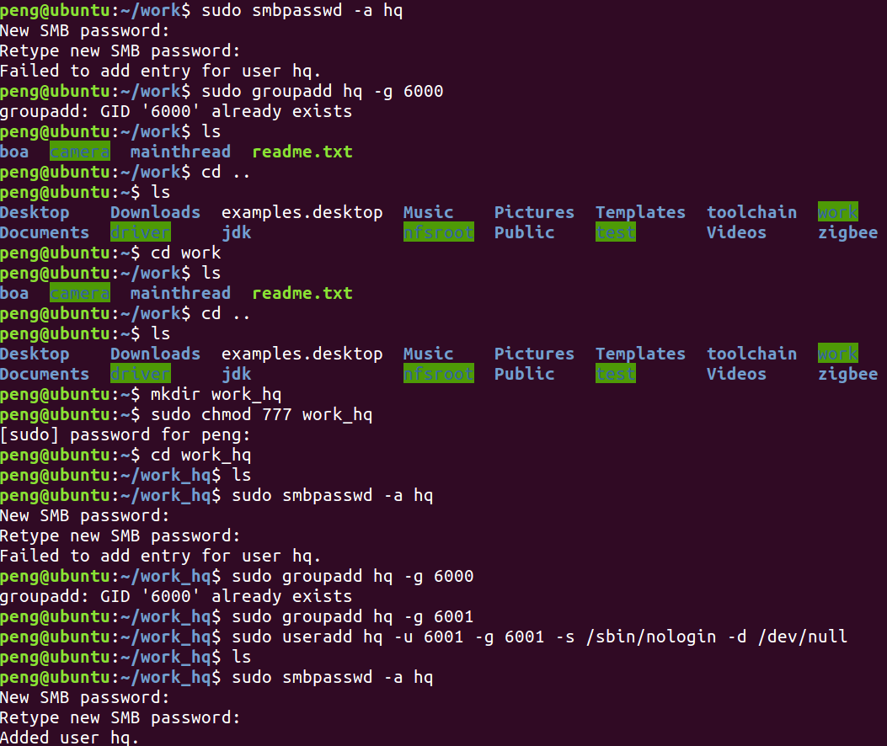

**修改samba服务器配置文件**

> 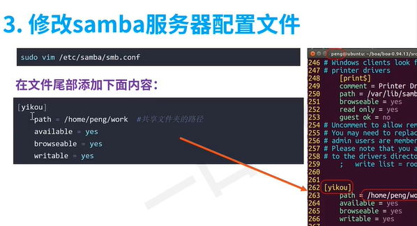

**重启samba服务**

> 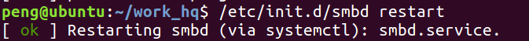

**windows创建映射**

> 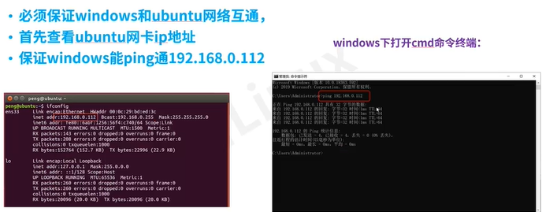
>
> 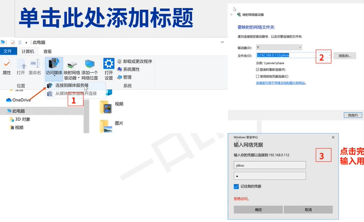
>
> 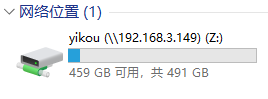

### PC识别串口方法

如果该串口被PC获取，名字为COMn【n为某整数】。

> 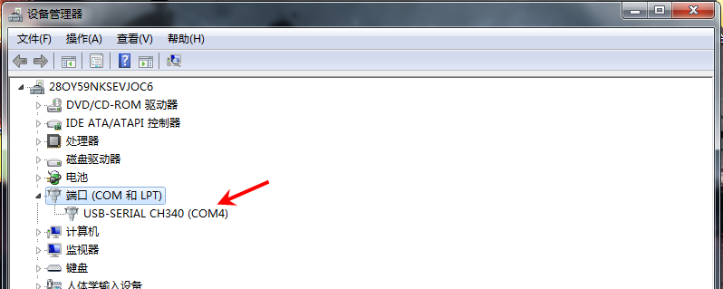
>

### Ubuntu识别串口方法

首先需要vmware抓取串口【串口在同一时刻要么被windows抓取要么被vmware抓取】，按下图所示，点击连接即可。

> 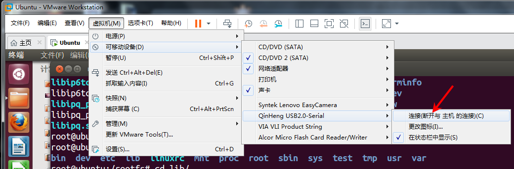
>

但是往往ubuntu中没有ch340的驱动，经过实际测试，ubuntu14及之前的版本都没有这个驱动，ubuntu16以上的版本有这个驱动。

如果没有ch340驱动可以用以下方法安装对应的驱动：

```shell
make 
sudo make load
ls /dev/ttyUSB0
```

> 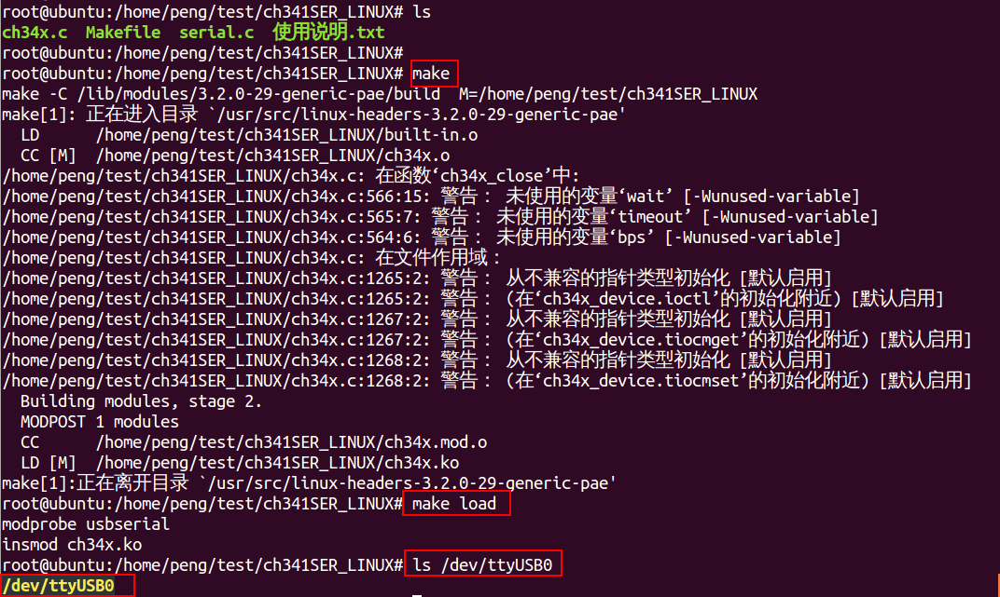
>

按照上述步骤，会生成设备文件**/dev/ttyUSB0**。

```shell
ls /dev/ttyUSB0 -l
crw-rw---- 1 root dialout 188, 0 Jan 15 05:45 /dev/ttyUSB0
```


## 项目模块设计（以串口模块为例）

### 1. 信令

上位机和下位机的通信往往都是通过串口，linux下往往生成字符设备ttyUSB0【有的是ttyS0】，操作串口设备就只需要操作该字符设备即可。

设计上位机，首先需要设计上位机下发给下位机的指令格式，上位机按照该指令格式发送命令给下位机，下位需严格按照该指令格式进行解析指令。

> 

含义如下：

- device：要操作的设备
- data ：对应的设备及其额外的数据
- CRC ：校验码
- \#    :信令终止符

信令格式可以根据需要扩展或者精简。

其中device定义如下【可以根据实际情况进行扩展】：

```c
#define DEV_ID_LED_ON    0X1
#define DEV_ID_LED_OFF    0X2
#define DEV_ID_DELAY 0X3
#define DEV_ID_GAS  0X4
```

### 2. 上传数据

下位机需要采集传感器的数据并通过串口上传，数据结构定义如下：

```c
struct data{
 unsigned char device;
 unsigned char crc;   
 unsigned short data;
};
```

- device  设备
- data   采集的数据
- crc    校验码

### 3. 功能模块

#### 下位机

下位机主要任务就是循环接收上位机通过串口下发的数据，然后解析该指令内容，操作对应的硬件。

> 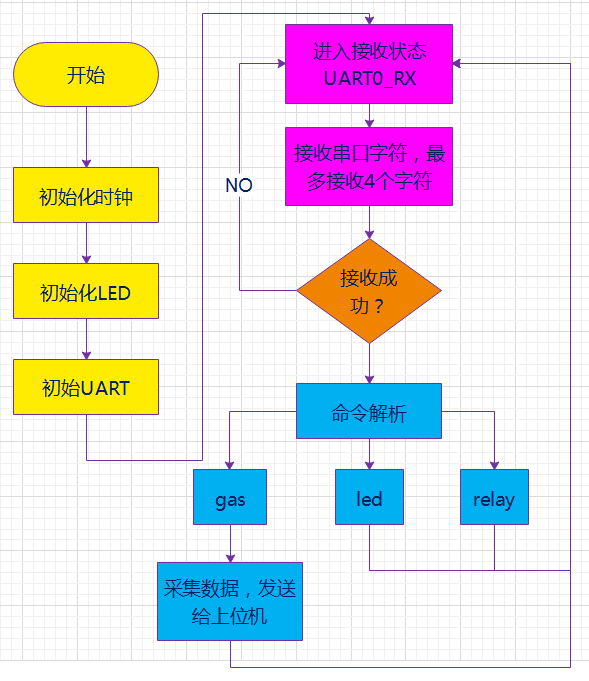
>

### 上位机

上位机主要任务是打印菜单，由用户针对菜单做出选择，然后按照指令格式封装命令，并通过串口将该命令下发给下位机。

> 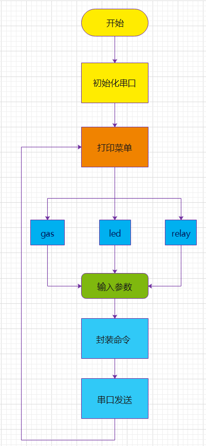
>


## 下位机功能函数（以串口模块为例）

### 1.  LED初始化

```c
/****************************************************************************
* 名    称: InitLed()
* 功    能: 设置LED灯相应的IO口
* 入口参数: 无
* 出口参数: 无
****************************************************************************/
void InitLed(void)
{
    P1DIR |= 0x01;               //P1.0定义为输出口
    LED1 = 0;   
}
```

### 2. 初始化UART

```c
/****************************************************************
* 名    称: InitUart()
* 功    能: 串口初始化函数
* 入口参数: 无
* 出口参数: 无
*****************************************************************/
void InitUart(void)
{ 
    PERCFG = 0x00;           //外设控制寄存器 USART 0的IO位置:0为P0口位置1 
    P0SEL = 0x0c;            //P0_2,P0_3用作串口（外设功能）
    P2DIR &= ~0xC0;          //P0优先作为UART0
    
    U0CSR |= 0x80;           //设置为UART方式
    U0GCR |= 11;           
    U0BAUD |= 216;           //波特率设为115200
    UTX0IF = 0;              //UART0 TX中断标志初始置位0
    U0CSR |= 0x40;           //允许接收 
    IEN0 |= 0x84;            //开总中断允许接收中断  
}
```

### 3. 串口发送函数

```c
/**********************************************************************
* 名    称: UartSendString()
* 功    能: 串口发送函数
* 入口参数: Data:发送缓冲区   len:发送长度
* 出口参数: 无
***********************************************************************/
void UartSendString(char *Data, int len)
{
    uint i;
    
    for(i=0; i<len; i++)
    {
        U0DBUF = *Data++;
        while(UTX0IF == 0);
        UTX0IF = 0;
    }
}
```

### 4. 串口中断处理函数

```c
/**********************************************************************
* 名    称: UART0_ISR(void) 串口中断处理函数 
* 描    述: 当串口0产生接收中断，将收到的数据保存在RxBuf中
**********************************************************************/
#pragma vector = URX0_VECTOR 
__interrupt void UART0_ISR(void) 
{ 
    URX0IF = 0;       // 清中断标志 
    RxBuf = U0DBUF;                           
}
```

### 5. 烟雾传感器数据读取

```c
/****************************************************************
* 名    称: myApp_ReadGasLevel()
* 功    能: 烟雾传感器数据读取
* 入口参数: 无
* 出口参数: 无
*****************************************************************/
uint16 myApp_ReadGasLevel( void )
{
  uint16 reading = 0;
  
  /* Enable channel */
  ADCCFG |= 0x80;
  
  /* writing to this register starts the extra conversion */
  ADCCON3 = 0x87;
  
  /* Wait for the conversion to be done */
  while (!(ADCCON1 & 0x80));
  
  /* Disable channel after done conversion */
  ADCCFG &= (0x80 ^ 0xFF);
  
  /* Read the result */
  reading = ADCH;
  reading |= (int16) (ADCH << 8); 
  reading >>= 8;
  
  return (reading);
}
```

### 6. LED灯控制函数

```c
/****************************************************************
* 名    称: led_opt()
* 功    能: LED灯控制函数
* 入口参数:  RxData：接收到的指令  flage：led的操作，点亮或者关闭
* 出口参数: 无
*****************************************************************/
void led_opt(char RxData[],unsigned char flage)
{
 switch(RxData[1])
 {
  case 1:
                  LED1 = (flage==DEV_ID_LED_ON)?ON:OFF;
   break;
  /* TBD for led2 led3*/

  
  default:
   break;
 }
 return;
}
```

### 7. 主程序

```c
/****************************************************************************
* 主程序入口函数
****************************************************************************/
void main(void)
{ 
 CLKCONCMD &= ~0x40;           //设置系统时钟源为32MHZ晶振
 while(CLKCONSTA & 0x40);      //等待晶振稳定为32M
 CLKCONCMD &= ~0x47;           //设置系统主时钟频率为32MHZ   

 InitLed();                    //设置LED灯相应的IO口
 InitUart();                   //串口初始化函数   
 UartState = UART0_RX;         //串口0默认处于接收模式
 memset(RxData, 0, SIZE);
      
 while(1)
 {
      //接收状态 
  if(UartState == UART0_RX)             
  { //读取数据，遇到字符'#'或者缓冲区字符数量超过4就设置UartState为CONTROL_DEV状态
   if(RxBuf != 0) 
   { 
    //以'#'为结束符,一次最多接收4个字符       
    if((RxBuf != '#')&&(count < 4))     
    { 
     RxData[count++] = RxBuf; 
    }
    else
    {
      //判断数据合法性，防止溢出
     if(count >= 4)            
     { 
      //计数清0
      count = 0;             
      //清空接收缓冲区
      memset(RxData, 0, SIZE);
     }
     else{
      //进入发送状态 
      UartState = CONTROL_DEV;
     }
    }
    RxBuf  = 0;
   }
  }
         //控制控制外设状态 
         if(UartState == CONTROL_DEV)            
         {
             //判断接收的数据合法性
   //RxData[]:  | device | data |crc | # |
   //check_crc:   crc = device ^ data
   //if(RxData[2] == (RxData[0]^RxData[1]))
   {
    switch(RxData[0])
    {
     case DEV_ID_LED_ON :
      led_opt(RxData,DEV_ID_LED_ON);
      break;
     case DEV_ID_LED_OFF:
      led_opt(RxData,DEV_ID_LED_OFF);
      break;
     case DEV_ID_DELAY:
      break;
     case DEV_ID_GAS:
      send_gas();
      break;   
     default:
      break;
    }        
   }
             UartState = UART0_RX;
             count = 0;     
   //清空接收缓冲区
             memset(RxData, 0, SIZE);           
  }
 }
}
```


## 上位机功能函数（以串口模块为例）

### 结构体

```c
#define DEV_ID_LED_ON    0X1
#define DEV_ID_LED_OFF    0X2
#define DEV_ID_DELAY 0X3
#define DEV_ID_GAS  0X4
struct data{
 unsigned char device;
 unsigned char crc; 
 unsigned short data;
};
```

### 函数

```c
void uart_init(void )
{
 int nset1,nset2;

 serial_fd = open( "/dev/ttyUSB0", O_RDWR);
 if(serial_fd == -1)
 {
  printf("open() error\n");
  exit(1);
 }
 nset1 = set_opt(serial_fd, 115200, 8, 'N', 1);
 if(nset2 == -1)
 {
  printf("set_opt() error\n");
  exit(1);
 }
}
int Menu() 
{
 int option;
 
 system("clear");

 printf("\n\t\t************************************************\n");
 printf("\n\t\t**               ALARM SYSTERM                **\n");
 printf("\n\t\t**               1----LED                     **\n");
 printf("\n\t\t**               2----GAS                   **\n");
 printf("\n\t\t**               0----EXIT                    **\n");
 printf("\n\t\t************************************************\n"); 
 while(1)
 { 
  printf("Please choose what you want: ");
  scanf("%d",&option); 
  if(option<0||option>2)
   printf("\t\t    choose error!\n");
  else 
   break;
 }
 return option; 
}
// RxData[]:  | device | data |crc | # |
void led()
{
 int lednum = 0;
 int onoff;

 char cmd[4];
 //选择led灯
 while(1)
 {
  printf("input led number :[1 2]\n#");

  scanf("%d",&lednum);
  //check  
  if(lednum<1 || lednum >2)
  {
   printf("invalid led number\n");
   system("clear");
   continue;
  }else{
   break;
  }
 }
 printf("operation: 1 on , 0  off\n");
 scanf("%d",&onoff); 

 if(onoff == 1)
 {
  cmd[0] = DEV_ID_LED_ON;
 }else if(onoff == 0)
 {
  cmd[0] = DEV_ID_LED_OFF;
 }else{
  printf("invalid led number\n");
  return;
 }
 
 cmd[1] = lednum;
 //fulfill crc  area
 cmd[2] = cmd[0]^cmd[1];  
 cmd[3] = '#';//表示结束符
 
 tcflush(serial_fd, TCIOFLUSH);

 int i = 0;

 for(i=0;i<4;i++)
 {
  printf("%d ",cmd[i]);
 }
 printf("\n");
 
 write(serial_fd,&cmd,sizeof(cmd));  
 
 sleep(1);
 
}
// RxData[]:  | device | data |crc | # |
void gas()
{
 int len ;
 unsigned short  GasLevel;
 struct data msg;
 char gas[4]={0};
 char cmd[4];
 
 cmd[0] = DEV_ID_GAS;
 cmd[3] = '#';//表示结束符
 write(serial_fd,&cmd,sizeof(cmd));
 sleep(1);
 
 len = read(serial_fd,&msg,sizeof(struct data));
 //转换读取的gas数据格式
 GasLevel = msg.data;
 gas[0] = GasLevel / 100 + '0';
 gas[1] = GasLevel / 10%10 + '0';
 gas[2] = GasLevel % 10 + '0';

 printf("%s\n",gas);
 getchar();
}
void run()
{
 int x;
 
 while(1)
 {  
  x=Menu(); 
  switch(x) 
  { 
   case 1:
    led();
    break;  
   case 2:
    gas();
    break; 
   case 0:
    printf("\n\t\t     exit!\n\n");
    close(serial_fd);
    exit(0);
   default:
    fg=1;
    break;
   }
   if(fg)
    break;
  }
}

int main() 
{
 uart_init();
 run();
 return 0;
}
```


## 项目运行效果（以串口模块为例）

### 上位机运行界面（主菜单）

> 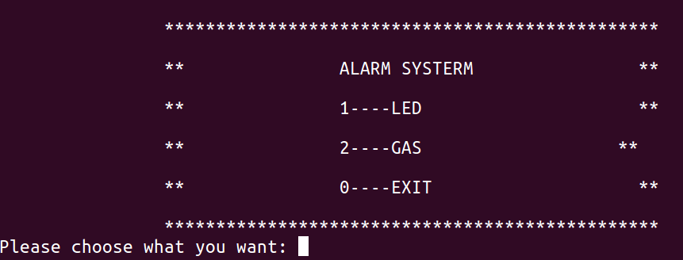
>

### 点亮led灯

> 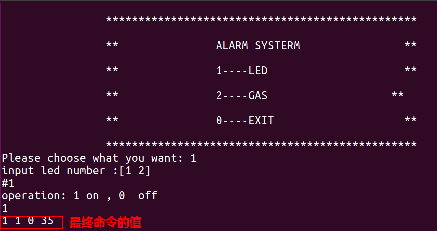
>

### 灭灯

> 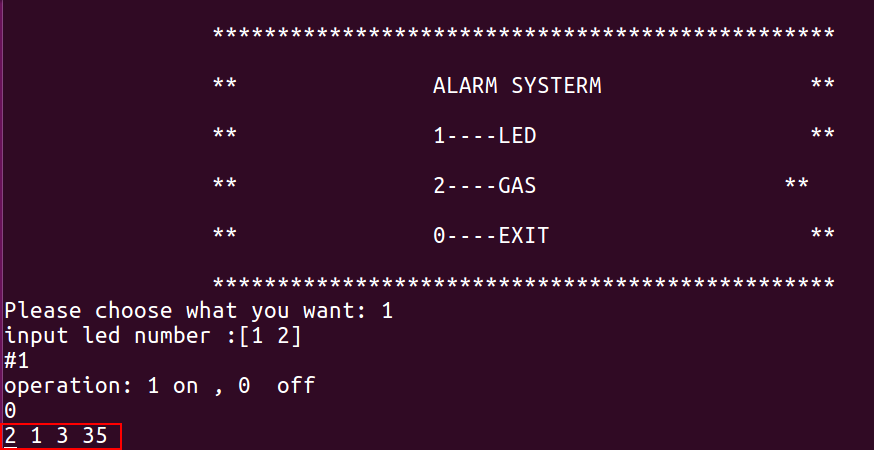
>

### 读取烟雾传感器数据

> 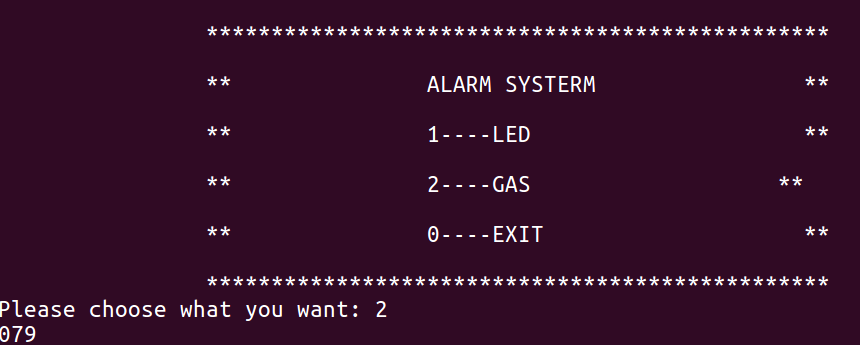
>


## 项目代码统计（仅Linux主控）

```c
Project Report for G:\知识汇总\0 - 个人学习\1 - 工程实践\Zigbee物联网项目开发\WirelessSersorMS\LINUX\main.si4project\main

Project Data Directory: G:\知识汇总\0 - 个人学习\1 - 工程实践\Zigbee物联网项目开发\WirelessSersorMS\LINUX\main.si4project
Project Source Directory: G:\知识汇总\0 - 个人学习\1 - 工程实践\Zigbee物联网项目开发\WirelessSersorMS\LINUX
Project contains 276 symbol records, 1020 index entries, and 15 files.

File                                                                                    大小      Obj  Lines      Date
------------------------------------------------------------------------------
data_global.c                                                                             2877        -     75      2022/8/6
    mutex_main_thread                                                                   (Variable at line 43-43)
    dev_camera_mask                                                                     (Variable at line 50-50)
    dev_uart_fd                                                                         (Variable at line 56-56)
    dev_uart_mask                                                                       (Variable at line 51-51)
    msgid                                                                               (Variable at line 58-58)
    mutex_camera                                                                        (Variable at line 44-44)
    mutex_global                                                                        (Variable at line 47-47)
    mutex_linklist                                                                      (Variable at line 48-48)
    mutex_refresh                                                                       (Variable at line 45-45)
    mutex_refresh_updata                                                                (Variable at line 46-46)
    mutex_slinklist                                                                     (Variable at line 40-40)
    mutex_uart_cmd                                                                      (Variable at line 42-42)
    mutex_zigbee_rcv                                                                    (Variable at line 41-41)
    semid                                                                               (Variable at line 60-60)
    void sendMsgQueue(long type, unsigned char text)                                    (Function at line 68-74)
    shmid                                                                               (Variable at line 59-59)
    storageNum                                                                          (Variable at line 64-64)
    zigbee_cache_head                                                                   (Variable at line 53-53)
    zigbee_cache_tail                                                                   (Variable at line 53-53)
    all_info_RT                                                                         (Variable at line 66-66)
    cond_camera                                                                         (Variable at line 35-35)
    cond_main_thread                                                                    (Variable at line 34-34)
    cond_refresh                                                                        (Variable at line 36-36)
    cond_refresh_updata                                                                 (Variable at line 37-37)
    cond_uart_cmd                                                                       (Variable at line 33-33)
    cond_zigbee_rcv                                                                     (Variable at line 32-32)
    dev_camera_fd                                                                       (Variable at line 55-55)
data_global.h                                                                             5426        -    205      2022/8/6
    sqlite_operation                                                                    (Structure at line 190-195)
        env_operation_mask                                                                  (Data Member at line 193-193)
        goods_operation_mask                                                                (Data Member at line 195-195)
        table_operation_mask                                                                (Data Member at line 194-194)
        table_select_mask                                                                   (Data Member at line 192-192)
    void sendMsgQueue(long, unsigned char)                                              (Function Prototype at line 157-157)
    MSG_CAMERA                                                                          (Constant at line 89-89)
    MSG_CONNECT_SUCCESS                                                                 (Constant at line 93-93)
    MSG_LED                                                                             (Constant at line 87-87)
    MSG_LED_HUM_OFF                                                                     (Constant at line 74-74)
    MSG_LED_HUM_ON                                                                      (Constant at line 73-73)
    MSG_LED_ILL_OFF                                                                     (Constant at line 76-76)
    MSG_LED_ILL_ON                                                                      (Constant at line 75-75)
    MSG_LED_TEM_OFF                                                                     (Constant at line 70-70)
    MSG_LED_TEM_ON                                                                      (Constant at line 69-69)
    MSG_LED_TRI_OFF                                                                     (Constant at line 78-78)
    MSG_LED_TRI_ON                                                                      (Constant at line 77-77)
    MSG_ZIGBEE                                                                          (Constant at line 90-90)
    MSG_M0_BEEP_AU_OFF                                                                  (Constant at line 101-101)
    MSG_M0_BEEP_AU_ON                                                                   (Constant at line 102-102)
    MSG_M0_BEEP_OFF                                                                     (Constant at line 99-99)
    MSG_M0_BEEP_ON                                                                      (Constant at line 100-100)
    MSG_M0_FAN_OFF                                                                      (Constant at line 94-94)
    MSG_M0_FAN_ON1                                                                      (Constant at line 95-95)
    MSG_M0_FAN_ON2                                                                      (Constant at line 96-96)
    MSG_M0_FAN_ON3                                                                      (Constant at line 97-97)
    MSG_M0_LED_OFF                                                                      (Constant at line 104-104)
    MSG_M0_LED_ON                                                                       (Constant at line 105-105)
    MSG_M0_SEG_OFF                                                                      (Constant at line 108-108)
    MSG_M0_SEG_ON                                                                       (Constant at line 107-107)
    void * pthread_camera(void *)                                                       (Function Prototype at line 154-154)
    void * pthread_main(void *)                                                         (Function Prototype at line 153-153)
    void * pthread_refresh(void *)                                                      (Function Prototype at line 155-155)
    QUEUE_MSG_LEN                                                                       (Constant at line 121-121)
    void * pthread_uart_send(void *)                                                    (Function Prototype at line 152-152)
    void * pthread_zigbee_rcv(void *)                                                   (Function Prototype at line 151-151)
    msg                                                                                 (Structure at line 198-202)
        msgtype                                                                             (Data Member at line 201-201)
        text                                                                                (Data Member at line 202-202)
        type                                                                                (Data Member at line 200-200)
    MSG_BEEP                                                                            (Constant at line 88-88)
    MSG_BEEP_OFF                                                                        (Constant at line 82-82)
    MSG_BEEP_ON                                                                         (Constant at line 83-83)
    GOODS_REDUCE                                                                        (Constant at line 116-116)
    env_info_array                                                                      (Structure at line 185-187)
        env_no                                                                              (Data Member at line 187-187)
    ENV_UPDATE                                                                          (Constant at line 110-110)
    GOODS_ADD                                                                           (Constant at line 115-115)
    GOODS_GET                                                                           (Constant at line 117-117)
    LEN_ENV                                                                             (Constant at line 124-124)
    BEEP_OFF                                                                            (Constant at line 57-57)
    BEEP_ON                                                                             (Constant at line 58-58)
    COLLECT_CURRENT_GET                                                                 (Constant at line 114-114)
    COLLECT_INSERTER                                                                    (Constant at line 112-112)
    COLLECT_TIME_GET                                                                    (Constant at line 113-113)
    __DATA_GLOBAL__H__                                                                  (Constant at line 29-29)
    DEV_CAMERA                                                                          (Constant at line 54-54)
    DEV_ZIGBEE                                                                          (Constant at line 53-53)
    ENDPOIT_NUM                                                                         (Constant at line 64-64)
    ENV_GET                                                                             (Constant at line 111-111)
    env_info                                                                            (Structure at line 159-182)
        humidity                                                                            (Data Member at line 173-173)
        humidityMAX                                                                         (Data Member at line 175-175)
        humidityMIN                                                                         (Data Member at line 174-174)
        illumination                                                                        (Data Member at line 177-177)
        illuminationMAX                                                                     (Data Member at line 179-179)
        illuminationMIN                                                                     (Data Member at line 178-178)
        samplingTime                                                                        (Data Member at line 169-169)
        temperature                                                                         (Data Member at line 170-170)
        temperatureMAX                                                                      (Data Member at line 172-172)
        temperatureMIN                                                                      (Data Member at line 171-171)
        x                                                                                   (Data Member at line 166-166)
        y                                                                                   (Data Member at line 167-167)
        z                                                                                   (Data Member at line 168-168)
        hongwai                                                                             (Data Member at line 176-176)
        adc                                                                                 (Data Member at line 181-181)
        adcMIN                                                                              (Data Member at line 182-182)
        gas                                                                                 (Data Member at line 180-180)
        buzzer_status                                                                       (Data Member at line 163-163)
        fan_status                                                                          (Data Member at line 164-164)
        led_status                                                                          (Data Member at line 162-162)
        seg_status                                                                          (Data Member at line 165-165)
        storage_status                                                                      (Data Member at line 161-161)
link_list.c                                                                               2506        -     80      2022/8/6
    linklist CreateEmptyLinklist()                                                      (Function at line 37-43)
    int EmptyLinklist(linklist h)                                                       (Function at line 46-48)
    linklist GetLinknode(linklist h)                                                    (Function at line 51-61)
    int InsertLinknode(link_datatype x)                                                 (Function at line 64-77)
    envlinkTail                                                                         (Variable at line 34-34)
    envlinkHead                                                                         (Variable at line 34-34)
link_list.h                                                                               2075        -     49      2022/8/6
    linklist CreateEmptyLinklist()                                                      (Function Prototype at line 44-44)
    int EmptyLinklist(linklist h)                                                       (Function Prototype at line 45-45)
    linklist GetLinknode(linklist h)                                                    (Function Prototype at line 46-46)
    int InsertLinknode(link_datatype x)                                                 (Function Prototype at line 47-47)
    linklist                                                                            (Type Definition at line 38-41)
    linknode                                                                            (Type Definition at line 38-41)
    link_datatype                                                                       (Type Definition at line 32-35)
    __LIST_QUEUE_H____                                                                  (Constant at line 29-29)
    msg_pack                                                                            (Structure at line 32-35)
        msg_type                                                                            (Data Member at line 34-34)
        text                                                                                (Data Member at line 35-35)
    _node_                                                                              (Structure at line 38-41)
        data                                                                                (Data Member at line 40-40)
        next                                                                                (Data Member at line 41-41)
main.c                                                                                    5086        -    146      2022/8/6
    mutex_main_thread                                                                   (External Variable at line 48-48)
    mutex_global                                                                        (External Variable at line 52-52)
    mutex_linklist                                                                      (External Variable at line 53-53)
    mutex_refresh                                                                       (External Variable at line 50-50)
    mutex_refresh_updata                                                                (External Variable at line 51-51)
    mutex_slinklist                                                                     (External Variable at line 45-45)
    mutex_uart_cmd                                                                      (External Variable at line 47-47)
    mutex_zigbee_rcv                                                                    (External Variable at line 46-46)
    void ReleaseResource(int signo)                                                     (Function at line 71-105)
    semid                                                                               (External Variable at line 60-60)
    shmid                                                                               (External Variable at line 59-59)
    id_main_thread                                                                      (Variable at line 67-67)
    id_refresh                                                                          (Variable at line 69-69)
    id_uart_cmd                                                                         (Variable at line 66-66)
    id_zigbee_rcv                                                                       (Variable at line 65-65)
    int main(int argc, char * * argv)                                                   (Function at line 107-145)
    msgid                                                                               (External Variable at line 58-58)
    mutex_camera                                                                        (External Variable at line 49-49)
    all_info_RT                                                                         (External Variable at line 63-63)
    cond_camera                                                                         (External Variable at line 41-41)
    cond_main_thread                                                                    (External Variable at line 40-40)
    cond_refresh                                                                        (External Variable at line 42-42)
    cond_refresh_updata                                                                 (External Variable at line 43-43)
    cond_uart_cmd                                                                       (External Variable at line 39-39)
    cond_zigbee_rcv                                                                     (External Variable at line 38-38)
    dev_camera_fd                                                                       (External Variable at line 55-55)
    dev_uart_fd                                                                         (External Variable at line 56-56)
    id_camera                                                                           (Variable at line 68-68)
Makefile                                                                                   317        -     14      2022/4/9
    CC                                                                                  (Variable at line 1-1)
    CFLAGS1                                                                             (Variable at line 2-2)
    CFLAGS2                                                                             (Variable at line 3-3)
    clean                                                                               (Label at line 12-14)
    OBJS                                                                                (Variable at line 4-14)
    zigbee                                                                              (Label at line 6-11)
    zigbee                                                                              (Label at line 6-14)
pthread_camera.c                                                                          2505        -     64      2022/8/6
    cond_camera                                                                         (External Variable at line 35-35)
    dev_camera_fd                                                                       (External Variable at line 31-31)
    dev_camera_mask                                                                     (External Variable at line 30-30)
    mutex_camera                                                                        (External Variable at line 33-33)
    void * pthread_camera(void * arg)                                                   (Function at line 37-63)
pthread_main.c                                                                            3942        -    118      2022/8/6
    mutex_uart_cmd                                                                      (External Variable at line 42-42)
    zigbee_cache_tail                                                                   (External Variable at line 49-49)
    void * pthread_main(void * arg)                                                     (Function at line 51-117)
    cond_camera                                                                         (External Variable at line 36-36)
    cond_refresh                                                                        (External Variable at line 37-37)
    cond_sqlite                                                                         (External Variable at line 39-39)
    cond_uart_cmd                                                                       (External Variable at line 38-38)
    dev_buzzer_mask                                                                     (External Variable at line 33-33)
    dev_camera_mask                                                                     (External Variable at line 32-32)
    dev_led_mask                                                                        (External Variable at line 31-31)
    dev_uart_mask                                                                       (External Variable at line 34-34)
    zigbee_cache_head                                                                   (External Variable at line 49-49)
    msgid                                                                               (External Variable at line 46-46)
    mutex_camera                                                                        (External Variable at line 43-43)
    mutex_global                                                                        (External Variable at line 41-41)
    mutex_slinklist                                                                     (External Variable at line 44-44)
    all_info_RT                                                                         (External Variable at line 47-47)
pthread_refresh.c                                                                         5498        -    212      2022/8/6
    void getEnvPackage(link_datatype * buf)                                             (Function at line 75-119)
    getEnvMsg                                                                           (Structure at line 58-73)
        lux                                                                                 (Data Member at line 68-68)
        gas                                                                                 (Data Member at line 70-70)
        adc                                                                                 (Data Member at line 72-72)
        rsv3                                                                                (Data Member at line 71-71)
        hum                                                                                 (Data Member at line 61-61)
        rsv2                                                                                (Data Member at line 69-69)
        ep_no                                                                               (Data Member at line 62-62)
        tem                                                                                 (Data Member at line 60-60)
        x                                                                                   (Data Member at line 63-63)
        y                                                                                   (Data Member at line 64-64)
        z                                                                                   (Data Member at line 65-65)
        hongwai                                                                             (Data Member at line 67-67)
    mutex_linklist                                                                      (External Variable at line 42-42)
    envlinkHead                                                                         (External Variable at line 48-48)
    all_info_RT                                                                         (External Variable at line 47-47)
    cond_refresh                                                                        (External Variable at line 40-40)
    cond_refresh_updata                                                                 (External Variable at line 41-41)
    envlinkTail                                                                         (External Variable at line 48-48)
    mutex_global                                                                        (External Variable at line 38-38)
    mutex_refresh                                                                       (External Variable at line 36-36)
    mutex_refresh_updata                                                                (External Variable at line 37-37)
    mutex_slinklist                                                                     (External Variable at line 39-39)
    N                                                                                   (Constant at line 34-34)
    void * pthread_refresh(void * arg)                                                  (Function at line 122-210)
    qt_status                                                                           (External Variable at line 44-44)
    semid                                                                               (External Variable at line 46-46)
    shmid                                                                               (External Variable at line 45-45)
    shm_addr                                                                            (Structure at line 50-54)
        cgi_status                                                                          (Data Member at line 52-52)
        qt_status                                                                           (Data Member at line 53-53)
        rt_status                                                                           (Data Member at line 54-54)
pthread_uart_send.c                                                                       2707        -     66      2022/8/6
    cond_uart_cmd                                                                       (External Variable at line 33-33)
    dev_uart_fd                                                                         (External Variable at line 31-31)
    dev_uart_mask                                                                       (External Variable at line 30-30)
    void * pthread_uart_send(void * arg)                                                (Function at line 39-65)
    zigbee_cache_head                                                                   (External Variable at line 37-37)
    mutex_uart_cmd                                                                      (External Variable at line 35-35)
    zigbee_cache_tail                                                                   (External Variable at line 37-37)
pthread_zigbee_rcv.c                                                                      3816        -    130      2022/8/6
    cond_refresh                                                                        (External Variable at line 37-37)
    dev_uart_fd                                                                         (External Variable at line 33-33)
    envlinkHead                                                                         (External Variable at line 35-35)
    mutex_linklist                                                                      (External Variable at line 36-36)
    void * pthread_zigbee_rcv(void * arg)                                               (Function at line 58-129)
    void serial_init(int fd)                                                            (Function at line 39-55)
sem.h                                                                                     2574        -     83      2022/8/6
    int init_sem(int semid, int num, int val)                                           (Function at line 41-50)
    semun                                                                               (Union at line 33-38)
        array                                                                               (Data Member at line 36-36)
        buf                                                                                 (Data Member at line 35-35)
        __buf                                                                               (Data Member at line 37-37)
        val                                                                                 (Data Member at line 34-34)
    __SEM_H__                                                                           (Constant at line 29-29)
    int sem_p(int semid, int num)                                                       (Function at line 53-65)
    int sem_v(int semid, int num)                                                       (Function at line 68-80)
test.c                                                                                    2973        -    113      2022/8/6
    UINT8 born_cmd(UINT8 ep_no, UINT8 device, UINT8 data)                               (Function at line 59-61)
    DEVICE_BEEP                                                                         (Enum Constant at line 54-54)
    DEVICE_LED                                                                          (Enum Constant at line 55-55)
    DEVICE_MAX                                                                          (Enum Constant at line 56-56)
    int main()                                                                          (Function at line 64-112)
    msg                                                                                 (Structure at line 45-49)
        msgtype                                                                             (Data Member at line 48-48)
        text                                                                                (Data Member at line 49-49)
        type                                                                                (Data Member at line 47-47)
    N                                                                                   (Constant at line 40-40)
    UINT8                                                                               (Constant at line 43-43)
    DEVICE_RELY                                                                         (Enum Constant at line 53-53)
uart_cache.c                                                                              2553        -     80      2022/8/6
    uart_cache_list CreateEmptyCacheList()                                              (Function at line 34-39)
    int EmptyCacheList(uart_cache_list h)                                               (Function at line 43-45)
    uart_cache_list GetCacheNode(uart_cache_list h, uart_cache_list * t)                (Function at line 48-61)
    int InsertCacheNode(uart_cache_list * t, uart_cache_data x)                         (Function at line 64-77)
uart_cache.h                                                                              2159        -     48      2022/8/6
    uart_cache_list CreateEmptyCacheList()                                              (Function Prototype at line 43-43)
    int EmptyCacheList(uart_cache_list)                                                 (Function Prototype at line 44-44)
    uart_cache_list GetCacheNode(uart_cache_list, uart_cache_list *)                    (Function Prototype at line 45-45)
    int InsertCacheNode(uart_cache_list *, uart_cache_data)                             (Function Prototype at line 46-46)
    uart_cache_data                                                                     (Type Definition at line 35-35)
    __UART_CACHE_H__                                                                    (Constant at line 29-29)
    uart_cache_list                                                                     (Type Definition at line 37-40)
    uart_cache_node                                                                     (Type Definition at line 37-40)
    _uart_node_                                                                         (Structure at line 37-40)
        data                                                                                (Data Member at line 39-39)
        next                                                                                (Data Member at line 40-40)

Total Files:           15
Total Bytes:        47014
Total Lines:         1483
Total Symbols:        276
```


