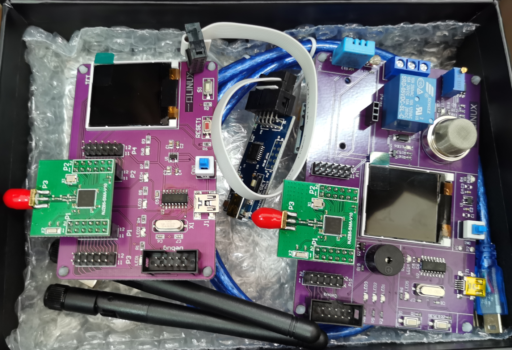
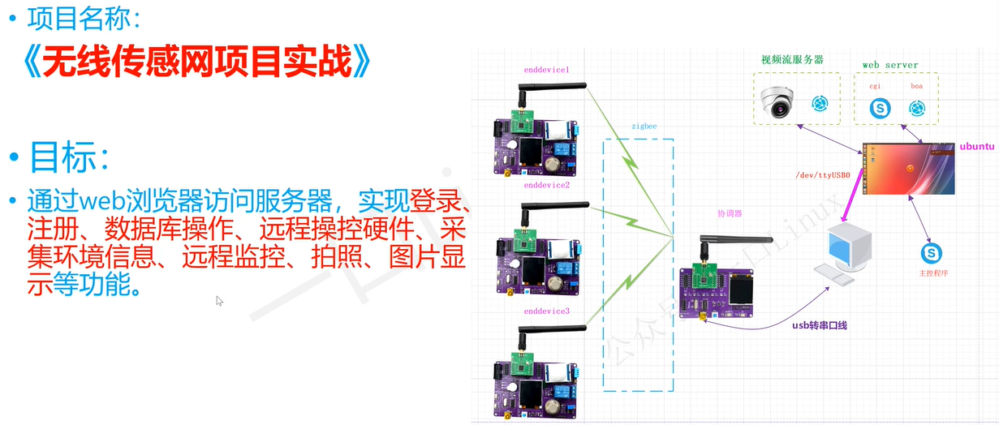
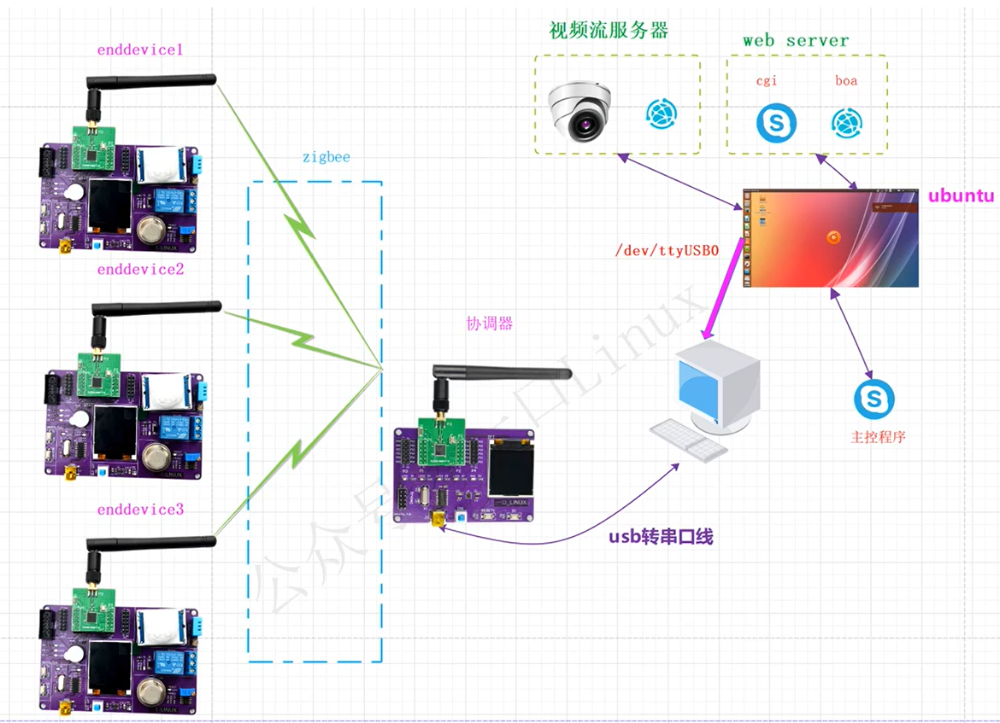
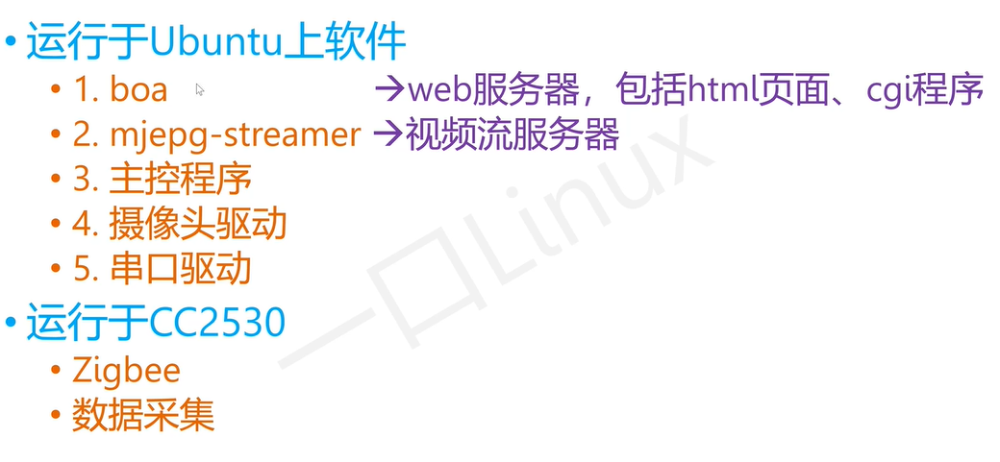
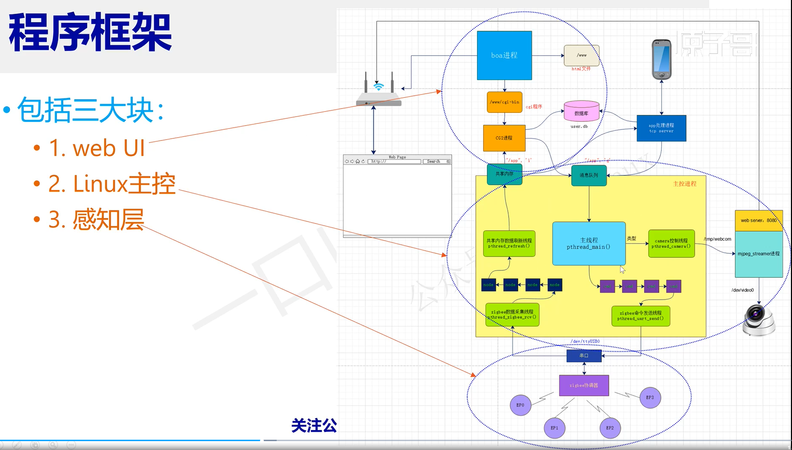
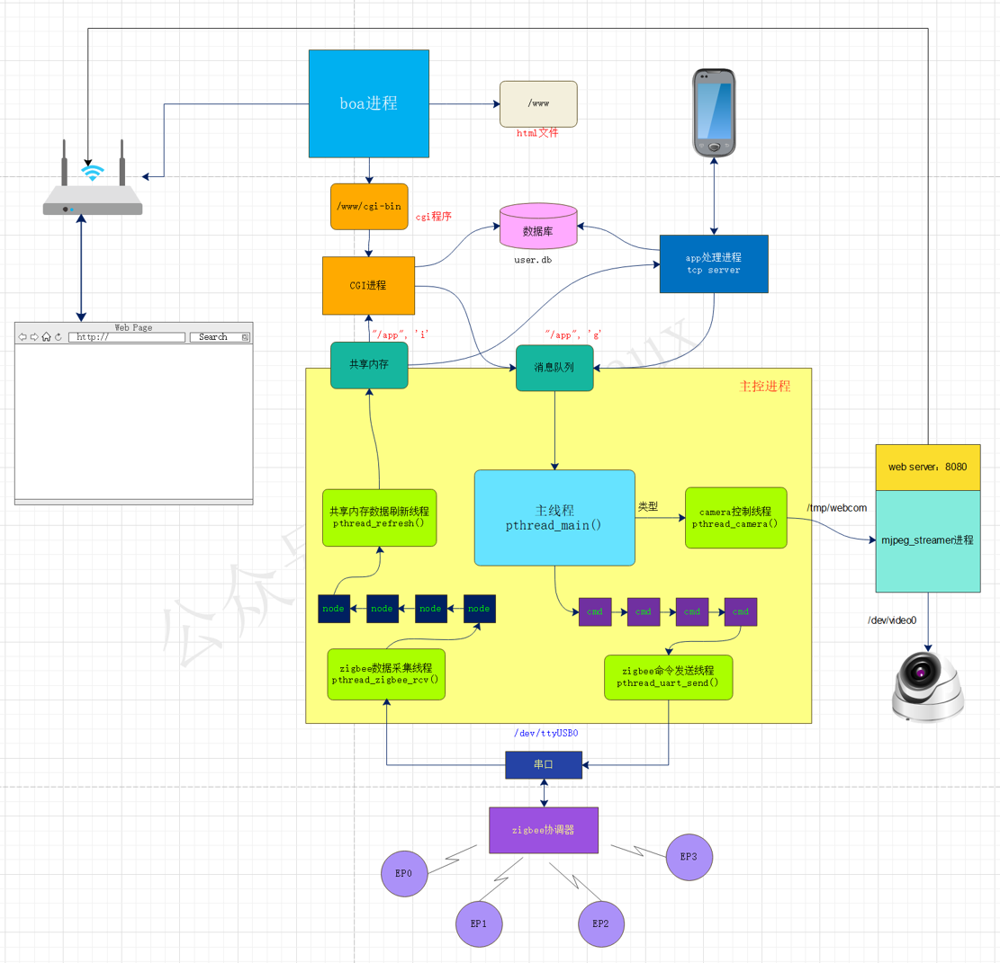
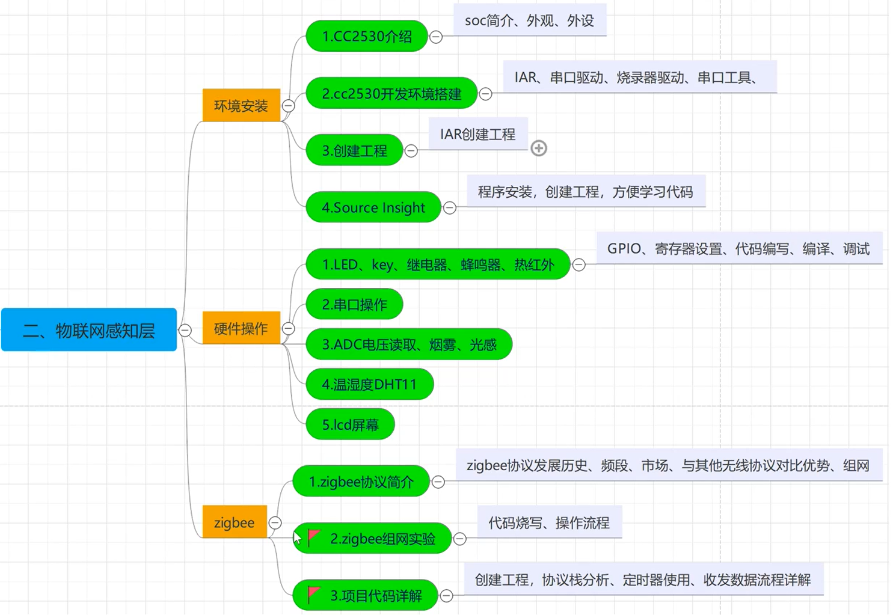
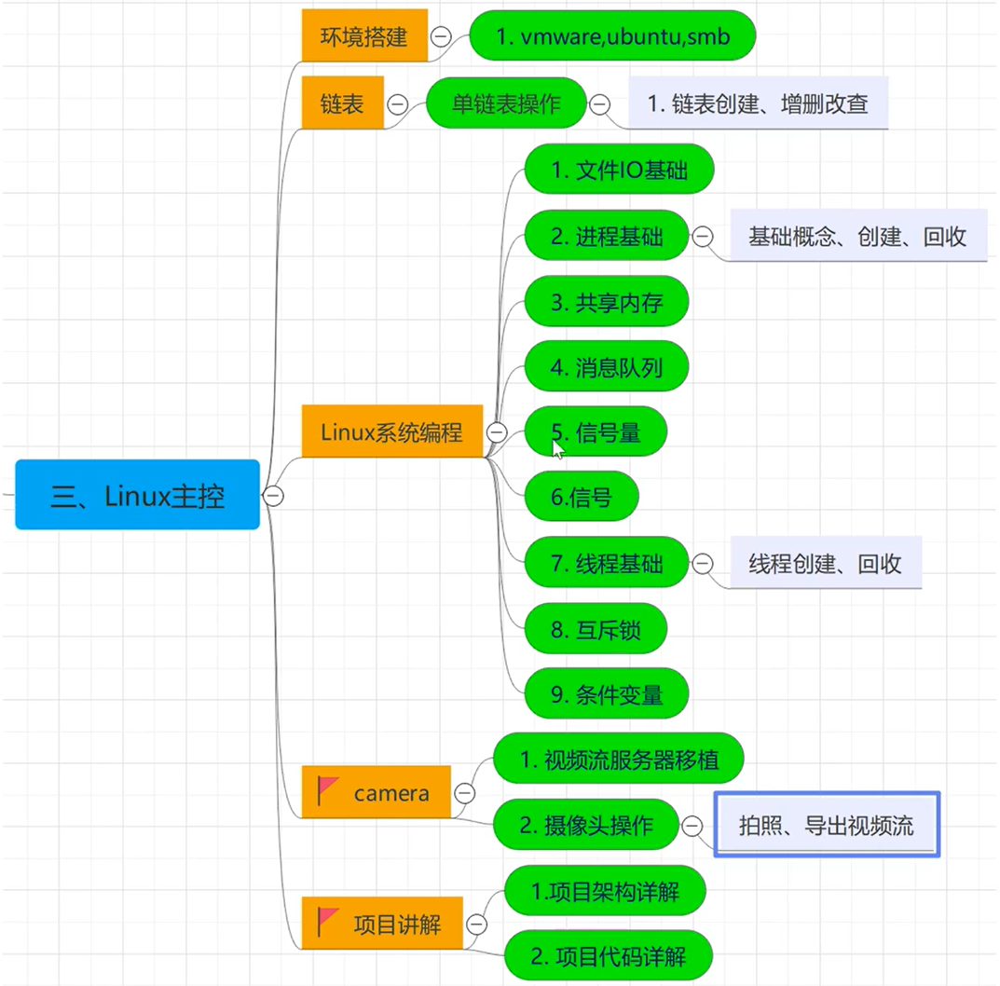
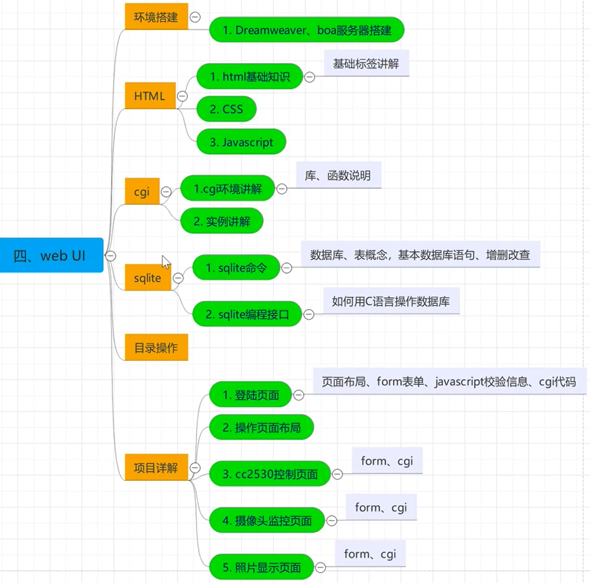

# WirelessSersorMS - 无线传感监测系统

[TOC]

------

#### 注意

- ==项目正在学习完善中，点个star，敬请期待 ...== 

------

## 项目简介

中文：无线传感监测系统

英文简称：WirelessSersorMS

英文全称：Wireless sensor monitoring system

**开源仓库：**

【[GitHub链接](https://github.com/wuxiaolie/WirelessSersorMS)】  【[Gitee链接](https://gitee.com/yang-haoqing/wireless-sersor-ms)】

**应用技术：**

多线程，Zigbee，Web开发(cgi/boa)，驱动开发，多种传感器(ADC/温湿度/烟雾/光感/LCD)。        

**项目描述：**

系统以Zigbee为通讯协议，基于CC2530开发的协调器和多个终端节点进行组网，并将接收的数据通过串口发送到Linux主控。用户可通过Web浏览器访问服务器（主控），实现登录、注册、数据库操作；可远程遥控硬件，采集环境信息；还可进行远程监控、拍照，图片显示等功能。

> 

>
>
>


## 项目说明

### 软件运行清单

> 

### 软件开发环境 & 开发工具

> 


## 程序框架

> 
>
> 


## 项目架构

### 物联网感知层

> 

### Linux主控

> 

### Web UI

> 


## 项目配置

### web

```
{
html位置
/www/
}	
```

### cgi

```
{
源码目录
/home/peng/work/cgi

make
cp ./out/*.cgi /www/cgi-bin/

bin文件目录
/www/cgi-bin/	
}
```

### boa

```
{
代码位置
/home/peng/work/boa/boa-0.94.13/src

配置文件
/etc/boa/boa.conf
{
	114 DocumentRoot /www
	126 DirectoryIndex index.html
	196 ScriptAlias /cgi-bin/ /www/cgi-bin/
}
}
```

### 主控

```
{
源码位置
/home/peng/work/mainthread
}
```

### 摄像头

```
{
虚拟机->可移动设备->摄像头

/home/peng/work/camera/mjpg-streamer/mjpg-streamer

运行脚本

{
	sudo ./start.sh

配置
./mjpg_streamer -i "./input_uvc.so -y -d /dev/video0" -o "./output_http.so -w ./www" -o "./output_file.so -f /www/pice -d 150000"  
{
	jpeg摄像头去掉-y
	摄像头对应字符设备 /dev/video0，如果不一致需要修改
	照片存储目录/www/pice
	自动拍照时间 150000
}

}
}
```

### 数据库sqlite3

```
{
CREATE TABLE IF NOT EXISTS user(name text not null, password text not null);
INSERT INTO user VALUES('user','admin');
}
```

### 消息队列

```
{
sudo touch /app
sudo chmod 644 /app
}
```


