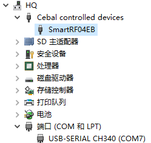
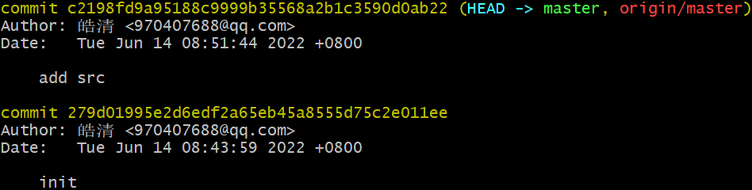

# 无线传感项目 - 开发流程 - HQ

[TOC]

------

#### 注意

- 

------

## 项目疑问

| 疑问     | 内容                                                         |
| -------- | ------------------------------------------------------------ |
| 网络通讯 | 自己写的服务端，客户端程序，只能在局域网内通讯，如果才能扩展到互联网呢？（内网穿透） |
|          |                                                              |
|          |                                                              |
|          |                                                              |
|          |                                                              |
|          |                                                              |
|          |                                                              |
|          |                                                              |

## 项目环境配置

### 烧写程序安装工具列表

>

项目新软件都安装在 `D:\EmbeddedSoftware`

1. 参考PPT【3.物联网感知层 - 环境安装 - 1】进行安装即可，**注意：要以管理员身份进行安装。**

   - IAR软件尽量安装到默认位置，C盘。

   - 驱动安装成功

     > 

2. IAR工程创建
   - 创建项目
   - 新建文件，添加新组，添加文件到新组
   - 编译程序，烧录程序

3. Source Insight工程创建

   - 如果中文乱码，选择以指定编码重载

     > 
     
   - 快捷键
   
     - 选中变量，按F8，则高亮这个变量的所有位置

## 项目开发流程

1. 新建Gitee仓库，配置仓库，添加README文档，整理项目文件。（2022.6.14）
   - https://gitee.com/yang-haoqing/wireless-sersor-ms
   - 
2. 

​      
